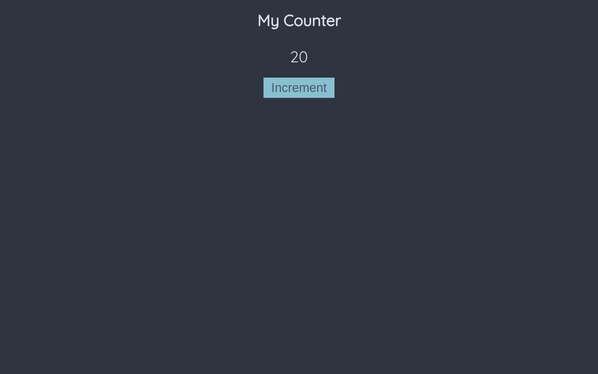

# Basic HTML Counter with Golang

This is a basic example of [html/template](https://pkg.go.dev/html/template).

## Test

```sh
# 1. Clone the repository
git clone git@github.com:brxyxn/go-html-template.git
# 2. Move into the cloned directory
cd go-html-template
# 3. Run main.go
go run main.go
```

Open <a href="http://localhost:8080/counter/" target="_blank">localhost:8080/counter/</a>

## Preview



